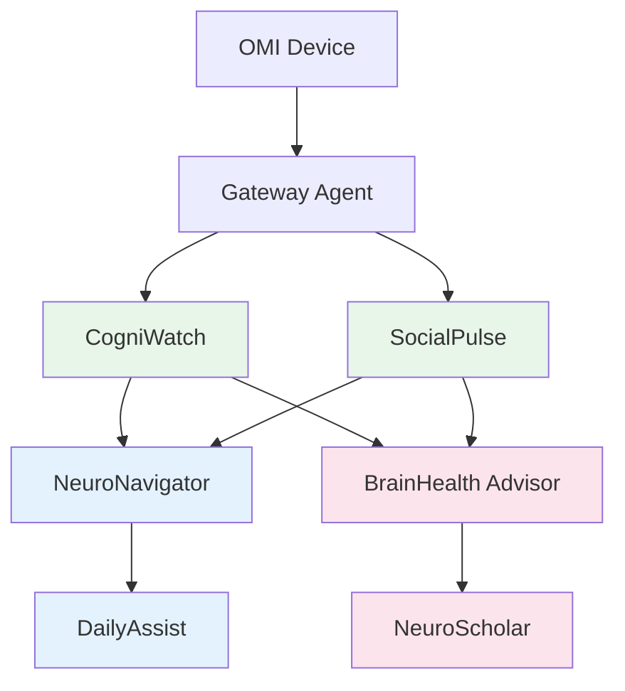

# NeuroHub Agent Catalog

## Overview
These agents extend OMI device capabilities for neurological health monitoring, early detection, and support. Each agent aligns with our Three Layer IA architecture and demonstrates specific value for brain health applications.

## Agent Classifications

### Semantic Layer Agents (Understanding & Analysis)

#### 1. Cognitive Pattern Agent
**Name**: CogniWatch  
**Purpose**: Monitor conversation patterns for early cognitive changes  
**Provider**: Claude/GPT-4 (high accuracy needed)  
**Layer**: Semantic (extracting meaning from patterns)

**Capabilities**:
- Word-finding difficulty detection
- Semantic fluency analysis
- Topic coherence tracking
- Memory consistency checking
- Language complexity trends

**Skills**:
```python
analyze_speech_patterns():
    - Measure pause frequency and duration
    - Track vocabulary diversity
    - Identify word substitutions
    - Detect semantic errors

track_memory_consistency():
    - Compare story versions over time
    - Flag contradictions
    - Measure detail retention
    - Identify confabulation patterns
```

**Educational Value**: Shows how AI can detect subtle language changes that may indicate early cognitive decline.

---

#### 2. Social Dynamics Agent
**Name**: SocialPulse  
**Purpose**: Analyze social interaction patterns and emotional well-being  
**Provider**: Gemini (multimodal capabilities)  
**Layer**: Semantic (understanding social context)

**Capabilities**:
- Conversation engagement metrics
- Emotional tone tracking
- Social isolation indicators
- Relationship quality analysis
- Mood pattern detection

**Skills**:
```python
analyze_social_health():
    - Measure conversation frequency
    - Track social network mentions
    - Detect withdrawal patterns
    - Identify support system strength

monitor_emotional_state():
    - Sentiment trend analysis
    - Emotional vocabulary usage
    - Stress indicator detection
    - Joy/engagement markers
```

**Educational Value**: Demonstrates how conversational AI can support mental health monitoring.

---

### Kinetic Layer Agents (Action & Coordination)

#### 3. Care Coordination Agent
**Name**: NeuroNavigator  
**Purpose**: Coordinate care team and manage healthcare logistics  
**Provider**: Local LLM (privacy-focused)  
**Layer**: Kinetic (orchestrating actions)

**Capabilities**:
- Appointment scheduling optimization
- Medication reminder integration
- Care team communication
- Insurance navigation
- Clinical trial matching

**Skills**:
```python
coordinate_appointments():
    - Optimize specialist visit sequences
    - Manage testing schedules
    - Send reminders to caregivers
    - Track visit outcomes

manage_care_team():
    - Summarize for providers
    - Share updates with family
    - Coordinate with therapists
    - Track treatment adherence
```

**Educational Value**: Shows practical healthcare automation and coordination benefits.

---

#### 4. Daily Living Agent
**Name**: DailyAssist  
**Purpose**: Support activities of daily living and routine management  
**Provider**: Gemma 2B (fast, local)  
**Layer**: Kinetic (real-time assistance)

**Capabilities**:
- Routine tracking and prompting
- Safety check-ins
- Task completion monitoring
- Environmental adaptation
- Emergency detection

**Skills**:
```python
monitor_routines():
    - Track daily pattern changes
    - Provide gentle reminders
    - Detect missed activities
    - Adapt to preferences

ensure_safety():
    - Monitor for confusion
    - Detect emergency keywords
    - Check medication timing
    - Alert caregivers if needed
```

**Educational Value**: Demonstrates real-time AI assistance for independence.

---

### Dynamic Layer Agents (Learning & Evolution)

#### 5. Personalized Insights Agent
**Name**: BrainHealth Advisor  
**Purpose**: Provide evolving, personalized brain health recommendations  
**Provider**: Claude (analytical depth)  
**Layer**: Dynamic (learning from patterns)

**Capabilities**:
- Lifestyle recommendation engine
- Risk factor analysis
- Progress tracking
- Research integration
- Predictive modeling

**Skills**:
```python
generate_insights():
    - Analyze longitudinal patterns
    - Correlate with research
    - Personalize recommendations
    - Track intervention success

adapt_strategies():
    - Learn user preferences
    - Adjust based on outcomes
    - Integrate new research
    - Evolve with condition
```

**Educational Value**: Shows how AI can provide personalized, evidence-based health guidance.

---

#### 6. Research Connection Agent
**Name**: NeuroScholar  
**Purpose**: Connect personal patterns with latest neuroscience research  
**Provider**: GPT-4 + PubMed API  
**Layer**: Dynamic (bridging personal and scientific)

**Capabilities**:
- Clinical trial matching
- Research paper summaries
- Treatment option analysis
- Breakthrough monitoring
- Community connection

**Skills**:
```python
match_research():
    - Find relevant studies
    - Summarize in plain language
    - Identify trial eligibility
    - Track new treatments

connect_community():
    - Find similar profiles
    - Share anonymized insights
    - Build support networks
    - Facilitate knowledge sharing
```

**Educational Value**: Demonstrates how AI can democratize access to neuroscience research.

---

## Implementation Architecture

### Agent Communication Flow


### Workshop Implementation

For the educational workshop, we'll implement simplified versions that demonstrate core concepts:

1. **Demo Mode**: Simulated responses showing agent capabilities
2. **Real Integration**: Actual API calls for select features
3. **Privacy First**: All processing local or anonymized
4. **Clear Visualization**: Dashboard showing agent insights

### Student Learning Objectives

1. **Understand Agent Specialization**: Each agent has a specific neurological focus
2. **See Real-World Value**: Practical applications for brain health
3. **Learn Integration Patterns**: How agents work together
4. **Explore Ethical Considerations**: Privacy, consent, and data handling

### Example Workshop Flow

```python
# Student captures conversation with OMI
omi_memory = capture_conversation()

# Semantic agents analyze
cognitive_insights = cogni_watch.analyze(omi_memory)
social_insights = social_pulse.analyze(omi_memory)

# Kinetic agents take action
care_actions = neuro_navigator.coordinate(cognitive_insights)
daily_support = daily_assist.support(social_insights)

# Dynamic agents learn and advise
health_advice = brain_advisor.recommend(all_insights)
research_connections = neuro_scholar.connect(health_advice)

# Visualize the multi-agent collaboration
dashboard.show_agent_network(all_results)
```

## Ethical Considerations

1. **Privacy**: All health data processed locally when possible
2. **Consent**: Clear opt-in for each agent's capabilities
3. **Transparency**: Show what each agent detects and why
4. **Control**: Users can disable any agent
5. **Clinical Boundaries**: Agents assist but don't diagnose

## Future Extensions

1. **Multimodal Analysis**: Integrate voice tone, facial expressions
2. **Wearable Integration**: Connect with health trackers
3. **Family Portal**: Secure sharing with care circle
4. **Longitudinal Studies**: Contribute to research (with consent)
5. **Cultural Adaptation**: Agents that understand diverse contexts