# NeuroHub Agents Workshop Guide

## 🧠 Building AI Agents for Brain Health

### Workshop Overview
In this workshop, you'll learn how specialized AI agents can extend the OMI device's capabilities to support neurological health monitoring and care coordination.

### Learning Objectives
1. Understand how agents can analyze conversation patterns
2. Learn to design agents for specific health applications  
3. Explore ethical considerations in health AI
4. Build your own neuro-focused agent

---

## Part 1: Understanding the Neuro Agents (30 min)

### The Agent Ecosystem

```mermaid
graph TD
    subgraph "Your OMI Device"
        OMI[Conversations & Memories]
    end
    
    subgraph "Semantic Layer - Understanding"
        CW[🧠 CogniWatch<br/>Cognitive Patterns]
        SP[💬 SocialPulse<br/>Social Dynamics]
    end
    
    subgraph "Kinetic Layer - Action"
        NN[📋 NeuroNavigator<br/>Care Coordination]
        DA[🏠 DailyAssist<br/>Daily Support]
    end
    
    subgraph "Dynamic Layer - Learning"
        BA[🎯 BrainHealth Advisor<br/>Personalized Insights]
        NS[📚 NeuroScholar<br/>Research Connection]
    end
    
    OMI --> CW & SP
    CW & SP --> NN & DA
    NN & DA --> BA
    BA --> NS
```



### Quick Demo
```bash
# Run the neuro agents demo
uv run python agents/neuro_demo.py
```

### What Each Agent Does

#### 1. CogniWatch (Cognitive Patterns)
- Detects word-finding difficulties
- Tracks vocabulary changes
- Monitors speech fluency
- **Real-world use**: Early detection of cognitive changes

#### 2. SocialPulse (Social Health)
- Analyzes emotional tone
- Tracks social engagement
- Detects isolation risks
- **Real-world use**: Mental health support

#### 3. NeuroNavigator (Care Coordination)
- Schedules appointments
- Coordinates care team
- Manages medications
- **Real-world use**: Healthcare logistics

#### 4. BrainHealth Advisor (Personalized Insights)
- Generates health recommendations
- Tracks progress over time
- Adapts to individual needs
- **Real-world use**: Preventive care guidance

---

## Part 2: Hands-On Implementation (45 min)

### Exercise 1: Analyze a Conversation

```python
# Sample conversation from workshop participant
conversation = """
[Your conversation with OMI device here]
"""

# Run through our agents
uv run python -c "
from agents.neuro_demo import run_neuro_demo
import asyncio
asyncio.run(run_neuro_demo('$conversation'))
"
```

### Exercise 2: Build Your Own Agent

Create a new file: `my_neuro_agent.py`

```python
"""
Template for creating your own neuro-focused agent
"""

class MyNeuroAgent:
    """
    Your agent description here
    Layer: [Semantic/Kinetic/Dynamic]
    Purpose: [What problem does it solve?]
    """
    
    def __init__(self, name: str):
        self.name = name
        self.layer = "semantic"  # Change based on your agent's role
        
    async def analyze(self, transcript: str) -> dict:
        """
        Your analysis logic here
        """
        # Example: Count questions to detect confusion
        questions = transcript.count("?")
        
        return {
            "agent_name": self.name,
            "analysis": {
                "questions_asked": questions,
                "confusion_level": "high" if questions > 5 else "low",
                "recommendation": "Provide clarification" if questions > 5 else "Continue monitoring"
            }
        }

# Test your agent
async def test_agent():
    agent = MyNeuroAgent("ConfusionDetector")
    result = await agent.analyze("What day is it? Where am I? Who are you?")
    print(result)

if __name__ == "__main__":
    import asyncio
    asyncio.run(test_agent())
```

### Exercise 3: Agent Collaboration

Design how your agent would work with others:

```python
# How would your agent interact with existing ones?
def design_collaboration():
    """
    If ConfusionDetector finds high confusion:
    1. -> NeuroNavigator: Schedule cognitive assessment
    2. -> DailyAssist: Increase check-in frequency
    3. -> BrainHealth Advisor: Adjust recommendations
    """
    pass
```

---

## Part 3: Ethical Considerations (15 min)

### Discussion Topics

1. **Privacy First**
   - What data should never leave the device?
   - How do we ensure user control?

2. **Assist, Don't Diagnose**
   - Why is this boundary important?
   - How do we communicate limitations?

3. **Inclusive Design**
   - How do we account for cultural differences?
   - What about language variations?

4. **Transparency**
   - How do we explain AI decisions?
   - What should users always know?

### Code Example: Privacy Controls

```python
class PrivacyAwareAgent:
    def __init__(self):
        self.privacy_settings = {
            "store_conversations": False,
            "share_with_family": False,
            "anonymous_research": False
        }
    
    def get_user_consent(self, action: str) -> bool:
        """Always ask before sensitive operations"""
        # In real app: Show UI prompt
        return self.privacy_settings.get(action, False)
```

---

## Part 4: Real-World Applications (30 min)

### Case Study 1: Early Detection
Sarah's OMI device + CogniWatch detected subtle speech changes over 6 months, prompting early intervention.

**Discussion**: What patterns might indicate concern?

### Case Study 2: Care Coordination  
Tom's NeuroNavigator helped manage appointments across 4 specialists, reducing missed visits by 80%.

**Discussion**: What other coordination challenges exist?

### Case Study 3: Social Support
Maria's SocialPulse identified increasing isolation, connecting her with local support groups.

**Discussion**: How can AI strengthen social connections?

---

## Part 5: Build and Present (30 min)

### Challenge: Design a New Neuro Agent

1. **Identify a Problem** (5 min)
   - What neurological health challenge interests you?
   - Who would benefit from your agent?

2. **Design Your Agent** (15 min)
   - Name and purpose
   - Which layer (Semantic/Kinetic/Dynamic)?
   - Key capabilities
   - Privacy considerations

3. **Present to Group** (10 min)
   - 2-minute pitch
   - How it helps users
   - How it works with other agents

### Presentation Template
```markdown
## Agent Name: [Your Agent Name]

**Problem**: [What challenge does it address?]

**Solution**: [How does your agent help?]

**Layer**: [Semantic/Kinetic/Dynamic]

**Key Features**:
1. [Feature 1]
2. [Feature 2]
3. [Feature 3]

**Privacy Approach**: [How do you protect user data?]

**Integration**: [How does it work with other agents?]
```

---

## Workshop Resources

### Quick Commands
```bash
# Run neuro demo
uv run python agents/neuro_demo.py

# Test your agent
uv run python my_neuro_agent.py

# See all agents in action
uv run python workshop_neuro_showcase.py
```

### Further Learning
1. **Paper**: "AI in Neurological Care" - [Link]
2. **Course**: "Building Health AI Responsibly" - [Link]
3. **Community**: NeuroHub Developers Discord - [Link]

### Get Help
- **Technical Issues**: Tag @tech-support
- **Agent Ideas**: Share in #agent-ideas
- **Ethics Questions**: Discuss in #ethics-health-ai

---

## Take-Home Challenge

Build an agent that helps with one of these scenarios:
1. Medication adherence tracking through conversation
2. Cognitive exercise recommendations based on interests
3. Family update generator for care circle
4. Mood pattern analysis for mental health
5. Your own idea!

Submit your agent design for feedback and potential inclusion in NeuroHub!

---

## 🎓 Key Takeaways

1. **Agents are Specialized Tools**: Each serves a specific purpose
2. **Layers Provide Structure**: Semantic → Kinetic → Dynamic
3. **Ethics are Essential**: Privacy, transparency, and boundaries
4. **Collaboration is Key**: Agents work together for better outcomes
5. **You Can Build This**: Start simple, iterate, and test

Happy building! 🚀