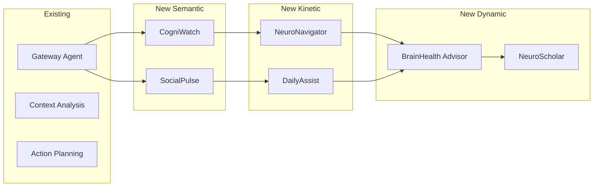

# ADR-012: Neurological Health Agent Extensions

## Status
Proposed

## Context
The current NeuroHub demonstration focuses on general multi-agent collaboration. To better serve the neurological health use case and provide more educational value, we need specialized agents that:
- Demonstrate real-world neurological health applications
- Show how AI can support early detection and care
- Align with our Three Layer IA architecture
- Provide clear value propositions for students

## Decision
Implement six specialized neuro-focused agents across the three IA layers:

### Semantic Layer (Analysis)
- **CogniWatch**: Cognitive pattern analysis
- **SocialPulse**: Social dynamics monitoring

### Kinetic Layer (Action)
- **NeuroNavigator**: Care coordination
- **DailyAssist**: Daily living support

### Dynamic Layer (Evolution)
- **BrainHealth Advisor**: Personalized insights
- **NeuroScholar**: Research connection

## Implementation Approach

### Phase 1: Workshop Demo (Week 1)
Create simulated versions for educational purposes:
```python
# agents/neuro_agents/cognitive_agent.py
class CognitivePatternAgent(A2AAgent):
    layer = "semantic"
    
    async def analyze_patterns(self, memory: OMIMemory) -> dict:
        # Simulated analysis for workshop
        return {
            "word_finding": self._analyze_pauses(memory.transcript),
            "topic_coherence": self._check_coherence(memory.transcript),
            "memory_consistency": self._compare_with_history(memory)
        }
```

### Phase 2: Real Integration (Week 2)
Integrate actual analysis capabilities:
- Connect to language analysis APIs
- Implement pattern detection algorithms
- Add longitudinal tracking

### Phase 3: Production Features (Week 3)
- Privacy-preserving local processing
- Clinical validation partnerships
- Family portal development

## Architecture Integration



## Consequences

### Positive
- **Educational Impact**: Clear demonstration of AI in healthcare
- **Real-World Relevance**: Addresses actual neurological needs
- **Scalable Architecture**: Easy to add more specialized agents
- **Research Potential**: Could contribute to neuroscience
- **Privacy-Focused**: Local processing where possible

### Negative
- **Complexity**: Six new agents to implement and maintain
- **Regulatory Concerns**: Health-related features need careful handling
- **Scope Creep**: Risk of over-promising capabilities
- **Testing Requirements**: Need clinical validation

### Neutral
- **Different Workshop Tracks**: Basic vs. advanced agent topics
- **Partnership Opportunities**: Could attract healthcare collaborators
- **Ethical Guidelines**: Need clear boundaries and disclaimers

## Alternatives Considered

1. **Generic Health Agents**: Less specific but easier to implement
2. **Single Super Agent**: One agent doing everything (rejected for clarity)
3. **External Service Integration**: Use existing health APIs (privacy concerns)
4. **Research-Only Focus**: No clinical features (less practical value)

## Implementation Guidelines

### Agent Development Template
```python
class NeuroAgent(A2AAgent):
    """Base class for neuro-focused agents"""
    
    def __init__(self):
        super().__init__()
        self.privacy_mode = True
        self.clinical_mode = False  # Never diagnose
        
    async def process(self, memory: OMIMemory) -> dict:
        # 1. Extract relevant features
        # 2. Apply domain-specific analysis
        # 3. Generate actionable insights
        # 4. Ensure privacy compliance
        pass
```

### Workshop Materials Needed
1. Agent capability demonstrations
2. Ethical use guidelines
3. Privacy controls explanation
4. Real-world case studies
5. Implementation exercises

## Risks and Mitigations

| Risk | Mitigation |
|------|------------|
| Over-promising medical capabilities | Clear disclaimers, "assist not diagnose" |
| Privacy concerns | Local processing, explicit consent |
| Complex for students | Phased learning, clear examples |
| Regulatory issues | Focus on wellness, not medical device |

## Success Metrics
- Student understanding of agent specialization
- Successful workshop implementations
- Positive feedback on real-world relevance
- No privacy or ethical incidents

## Related
- [ADR-011: Three Layer IA](011-three-layer-ia-alignment.md) - Architecture alignment
- [ADR-010: Memory Integration](010-memory-integration.md) - Memory analysis foundation
- [Neuro Agents Specification](../NEURO_AGENTS.md) - Detailed agent descriptions

## Notes
This extension transforms NeuroHub from a technical demonstration into a meaningful exploration of AI's potential in neurological health, while maintaining educational focus and ethical boundaries.