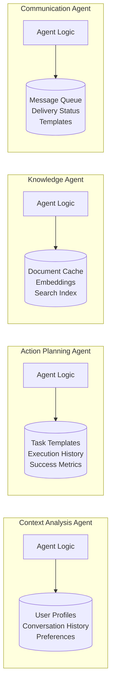
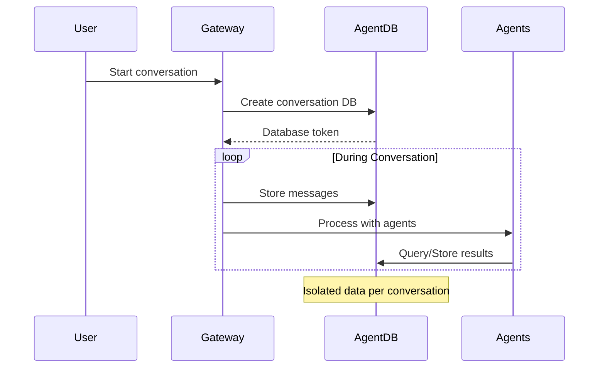

# AgentDB Integration Architecture

## Overview

AgentDB provides a serverless, zero-configuration database system designed specifically for AI agents. In our multi-agent system, it enables each agent and conversation to have isolated, persistent storage with built-in vector search capabilities.

## Integration Points

### 1. Per-Agent Databases

Each agent maintains its own persistent database for:



### 2. Per-Conversation Databases

Each conversation gets an isolated database:



## Database Schemas

### Agent Memory Schema

```sql
-- Agent configuration and state
CREATE TABLE agent_state (
    key TEXT PRIMARY KEY,
    value JSON,
    updated_at TIMESTAMP
);

-- Knowledge base with vectors
CREATE TABLE knowledge_base (
    id INTEGER PRIMARY KEY,
    content TEXT,
    embedding BLOB,  -- sqlite-vec vector
    metadata JSON,
    source TEXT
);

-- Task execution history
CREATE TABLE task_history (
    task_id TEXT PRIMARY KEY,
    input_data JSON,
    output_data JSON,
    status TEXT,
    timestamps JSON
);
```

### Conversation Schema

```sql
-- Messages with embeddings
CREATE TABLE messages (
    id INTEGER PRIMARY KEY,
    role TEXT,
    content TEXT,
    embedding BLOB,
    metadata JSON,
    timestamp TIMESTAMP
);

-- Extracted entities
CREATE TABLE entities (
    id INTEGER PRIMARY KEY,
    entity_type TEXT,
    entity_value TEXT,
    confidence REAL
);

-- Action items
CREATE TABLE action_items (
    id INTEGER PRIMARY KEY,
    description TEXT,
    assignee TEXT,
    deadline TEXT,
    status TEXT
);
```

## Usage Patterns

### 1. Agent Initialization

```python
# Each agent creates its database on startup
class ContextAnalysisAgent(A2AAgent):
    async def initialize(self):
        self.db_token = f"agent-{self.agent_id}-{uuid.uuid4()}"
        self.db = await agentdb_manager.create_agent_database(self.agent_id)
        
        # Load previous state
        state = await self.db.get_memory("agent_config")
        if state:
            self.config = state
```

### 2. Conversation Processing

```python
# Gateway creates conversation database
async def handle_new_conversation(conversation_id: str):
    # Create isolated database for this conversation
    conv_db = await agentdb_manager.create_conversation_database(
        conversation_id,
        user_id=user_id
    )
    
    # Store messages as they arrive
    await conv_db.add_message(role="user", content=transcript)
    
    # Agents can query this database
    context = await conv_db.search_similar_messages(query_embedding)
```

### 3. Vector Search Integration

```python
# Knowledge agent uses vector search
async def search_knowledge(query: str):
    # Generate embedding for query
    embedding = await generate_embedding(query)
    
    # Search using AgentDB's built-in vector support
    results = await db.execute({
        "sql": """
            SELECT content, metadata,
                   vec_distance_L2(embedding, ?) as distance
            FROM knowledge_base
            ORDER BY distance
            LIMIT 10
        """,
        "params": [embedding]
    })
```

## Benefits

### 1. **Zero Configuration**
- No database setup required
- Agents create databases on-demand
- No schema migrations needed

### 2. **Perfect Isolation**
- Each conversation is completely isolated
- GDPR compliance through easy deletion
- No cross-conversation data leaks

### 3. **Built-in Vector Search**
- Native support for RAG patterns
- No separate vector database needed
- Efficient similarity search

### 4. **Cost Efficiency**
- Pay only for queries and storage
- No idle database costs
- Scales from 0 to millions automatically

### 5. **MCP Integration**
- AgentDB acts as MCP server
- Agents can use databases as context
- Seamless integration with A2A

## Implementation Checklist

- [ ] Add AgentDB SDK to requirements
- [ ] Create AgentDBManager class
- [ ] Update each agent to use AgentDB
- [ ] Implement conversation isolation
- [ ] Add vector search for Knowledge Agent
- [ ] Create data export functionality
- [ ] Add monitoring and quotas
- [ ] Document backup procedures

## Security Considerations

1. **API Key Management**: Store AgentDB API key securely
2. **Data Encryption**: All data encrypted at rest
3. **Access Control**: Each agent only accesses its databases
4. **Audit Logging**: Track all database operations
5. **Data Retention**: Implement automatic cleanup policies

## Migration Path

If we need to migrate away from AgentDB:

1. Use export functionality to download SQLite files
2. Deploy local SQLite or PostgreSQL
3. Import data using standard SQLite tools
4. Update connection strings in agents

The SQLite compatibility ensures data portability.