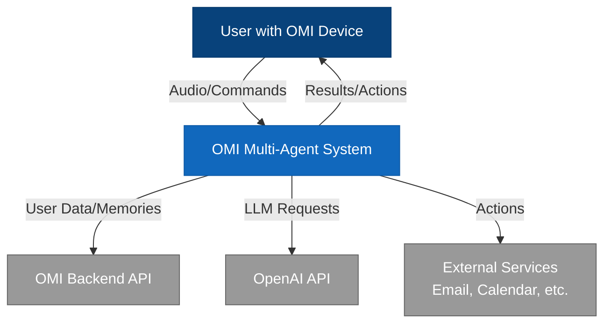
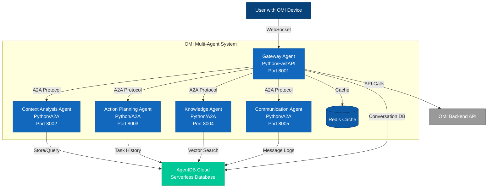
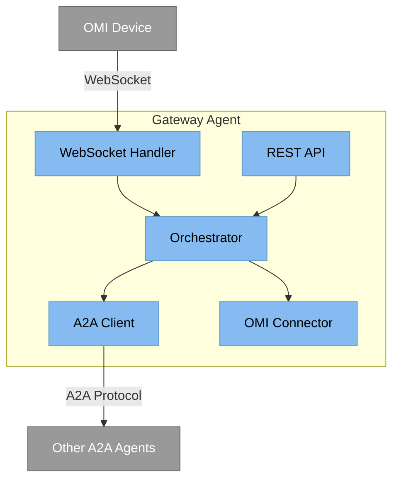
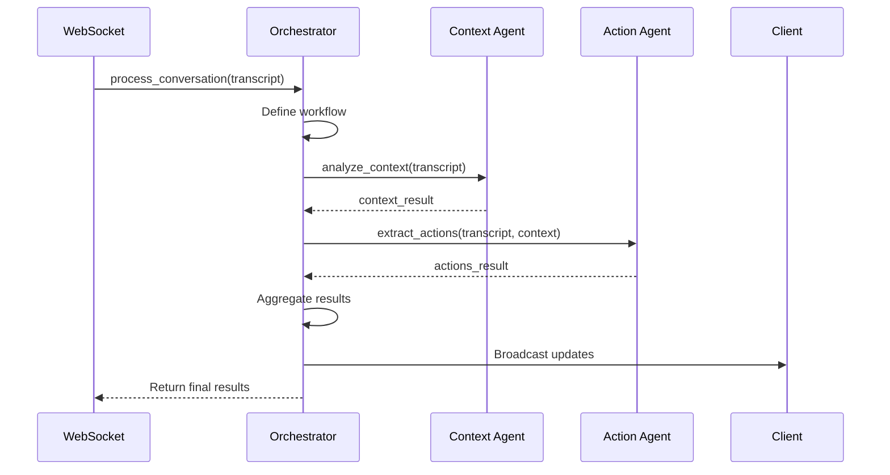

# C4 Architecture Diagrams

This document contains the C4 model diagrams for the OMI A2A Multi-Agent System.

## Level 1: System Context

Shows the OMI Multi-Agent System and its relationships with users and external systems.



## Level 2: Container Diagram

Shows the high-level containers (applications/services) within the system.



## Level 3: Component Diagram - Gateway Agent

Shows the internal components of the Gateway Agent.



## Level 4: Code - Orchestrator Workflow

Shows how the Orchestrator component processes a conversation.



## Deployment View

Shows how the system is deployed using Docker.

```mermaid
graph TB
    %% Styling
    classDef host fill:#e0e0e0,stroke:#999,color:#000
    classDef container fill:#1168bd,stroke:#0d5aa7,color:#fff
    classDef network fill:#d4e1f5,stroke:#a8c5e8,color:#000
    
    %% Infrastructure
    subgraph Host[Docker Host]:::host
        subgraph Network[a2a-network]:::network
            GW[omi-gateway:8001]:::container
            CA[context-agent:8002]:::container
            AP[action-agent:8003]:::container
            KN[knowledge-agent:8004]:::container
            CM[communication-agent:8005]:::container
            RD[(redis:6379)]:::container
        end
    end
    
    %% External connections
    Internet[Internet] --> Host
```

## Key Design Decisions

1. **Gateway Pattern**: All external communication flows through the gateway agent
2. **A2A Protocol**: Agents communicate using Google's A2A standard
3. **Docker Deployment**: Each agent runs in its own container
4. **WebSocket Integration**: Real-time communication with OMI devices
5. **Workflow Orchestration**: Gateway manages multi-agent workflows

## References

- [C4 Model](https://c4model.com/)
- [ADR-001: A2A Protocol](../adr/001-use-a2a-protocol.md)
- [ADR-002: Gateway Pattern](../adr/002-agent-orchestration-pattern.md)
- [ADR-003: Docker Deployment](../adr/003-docker-deployment.md)