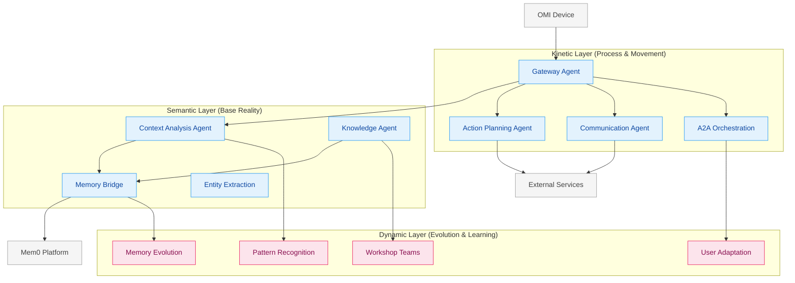
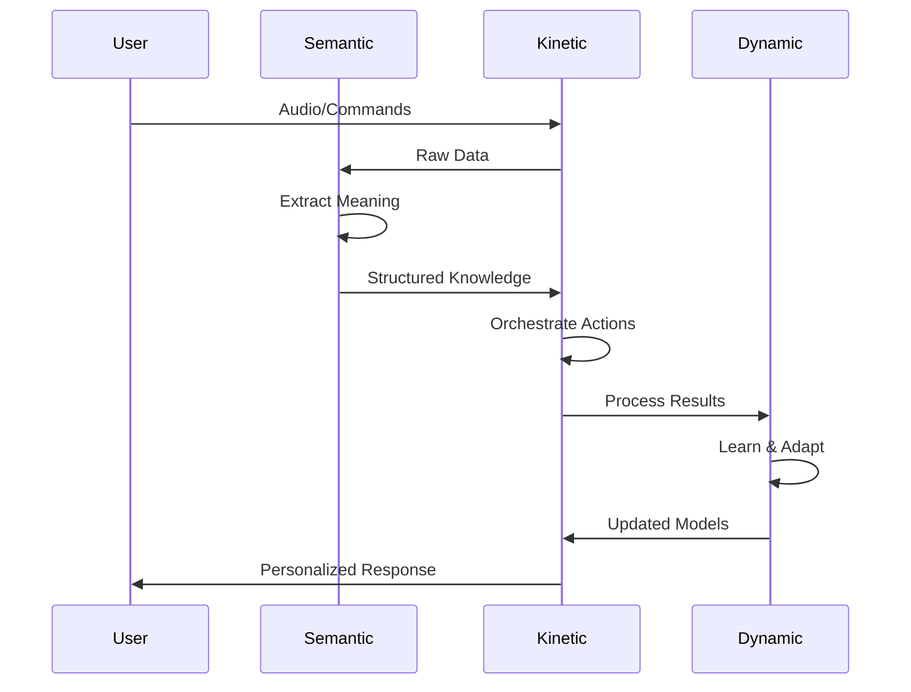

# Three Layer IA - Agent Mapping

This document visualizes how NeuroHub agents and components map to the Three Layer Information Architecture.

## Layer Overview



## Detailed Agent Mapping

### Semantic Layer Agents

| Agent/Component | Purpose | Key Responsibilities |
|----------------|---------|---------------------|
| **Context Analysis Agent** | Extract meaning from conversations | - Topic identification<br>- Sentiment analysis<br>- Intent recognition<br>- Entity extraction |
| **Knowledge Agent** | Store and retrieve information | - Vector storage<br>- Information retrieval<br>- Knowledge graphs<br>- Fact extraction |
| **Memory Bridge** | Structure memories for storage | - OMI memory conversion<br>- Mem0 format mapping<br>- Metadata enrichment |

### Kinetic Layer Agents

| Agent/Component | Purpose | Key Responsibilities |
|----------------|---------|---------------------|
| **Gateway Agent** | Orchestrate all workflows | - WebSocket management<br>- Agent coordination<br>- Result aggregation<br>- Error handling |
| **Action Planning Agent** | Track temporal sequences | - Action extraction<br>- Deadline management<br>- Priority assignment<br>- Task dependencies |
| **Communication Agent** | Execute external actions | - Email sending<br>- Calendar integration<br>- Notification dispatch<br>- API interactions |

### Dynamic Layer Components

| Component | Purpose | Key Responsibilities |
|-----------|---------|---------------------|
| **Mem0 Integration** | Enable memory persistence | - Long-term storage<br>- Memory evolution<br>- Cross-session context |
| **Workshop Teams** | Collective learning | - Team memory sharing<br>- Collaborative insights<br>- Group patterns |
| **Pattern Recognition** | Identify emerging insights | - Conversation trends<br>- Behavioral patterns<br>- Predictive modeling |

## Data Flow Between Layers



## Implementation Guidelines

### Creating New Agents

When creating new agents, identify which layer they belong to:

1. **Semantic Layer**: Focus on data extraction and structuring
   ```python
   class NewSemanticAgent(A2AAgent):
       layer = "semantic"
       # Extract, structure, enrich data
   ```

2. **Kinetic Layer**: Focus on process and coordination
   ```python
   class NewKineticAgent(A2AAgent):
       layer = "kinetic"
       # Orchestrate, route, execute
   ```

3. **Dynamic Layer**: Focus on learning and adaptation
   ```python
   class NewDynamicComponent:
       layer = "dynamic"
       # Learn, evolve, personalize
   ```

### Cross-Layer Communication

- **Upward**: Semantic → Kinetic → Dynamic (data enrichment)
- **Downward**: Dynamic → Kinetic → Semantic (model updates)
- **Lateral**: Within same layer only for specific workflows

## Benefits of This Architecture

1. **Clear Boundaries**: Each agent knows its role and scope
2. **Scalability**: Layers can scale independently
3. **Maintainability**: Changes isolated to specific layers
4. **Extensibility**: New capabilities map to clear locations
5. **Testability**: Layer interfaces enable focused testing

## References

- [Three Layer IA Principles](/Users/stephenszermer/Documents/Project Knowledge/Three Layer IA.md)
- [ADR-011: Three Layer IA Alignment](../adr/011-three-layer-ia-alignment.md)
- [Architecture Overview](README.md)
- [C4 Diagrams](c4-diagrams.md)